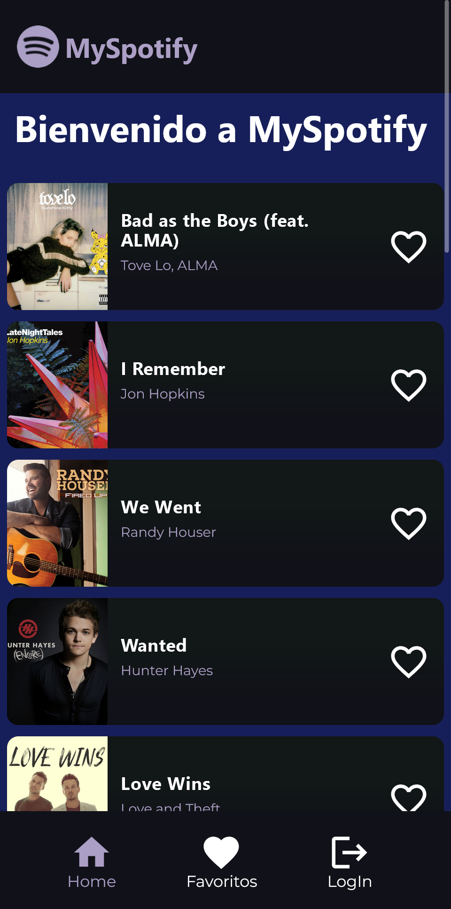
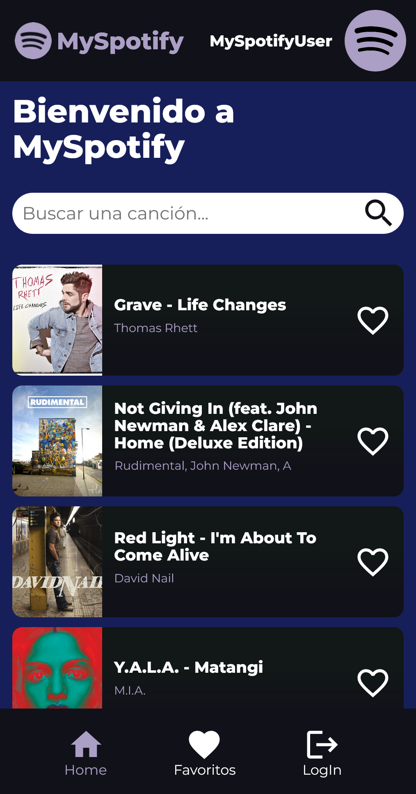

# MySpotify

Project created to work with spotify's api and Gatsby. To use the api, spotify require that register the email's user, for this reason you can test the app in https://myspotify.gatsby.io using next credentials:

- email: myspotifyreact@gmail.com
- password: myspotifyprueba

## :rocket: Technologies used

- spotify-web-api-node
- styled-components
- react-icons

## How is the app?

In the app there are 3 routes

- /
- /favoritos
- /login

When there isn't user home show default data, otherwise show random tracks and the component Searcher, to find some track. You can save your favorites songs clicking in card's heart and it will show in /favoritos

 
